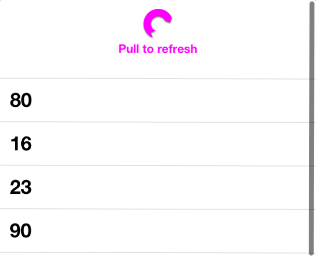

HKRefreshControl
================

HKRefreshControl is a refresh control that mimics iOS6's UIRefreshControl behavior but is also available for iOS5.
It uses [HKCircularProgressView](https://github.com/Harmek/HKCircularProgressView) to show the animated "pull progress" and "activity indicator" views but you can also implement views of your own.

How to use it
-------------

1. Use [CocoaPods](http://www.cocoapods.org) by adding *pod 'HKRefreshControl'* in your Podfile.
2. Manually:
  * Clone this repository
  * Copy HKRefreshControl and UITableViewController+HKRefreshControl files (.h and .m) into your project and do not forget [HKCircularProgressView](https://github.com/Harmek/HKCircularProgressView).

How to configure it
-------------------

A refresh control is usually used with a UITableView. This is why we included an extension to the UITableViewController class, to mimic UIRefreshControl's usage.

In order to associate your UITableView with a HKRefreshControl:

* In your UITableViewController, set the _customRefreshControl_ property (using a simple [[HKRefreshControl alloc] init]).
* Add a target and action for the _UIControlEventValueChanged_ control event.
* When _UIControlEventValueChanged_ is triggered (when the control is pulled), start refreshing your data.
* When your data is done refreshing, call _endRefreshing_ on the HKRefreshControl, it will stop the animations and hide the control.

Like UIRefreshControl, you can customize HKRefreshControl:

* tintColor: sets the tint color of the indicator views and the label (available through the UIAppearance API).
* attributedTitle: use this property to set a label at the bottom of the control.